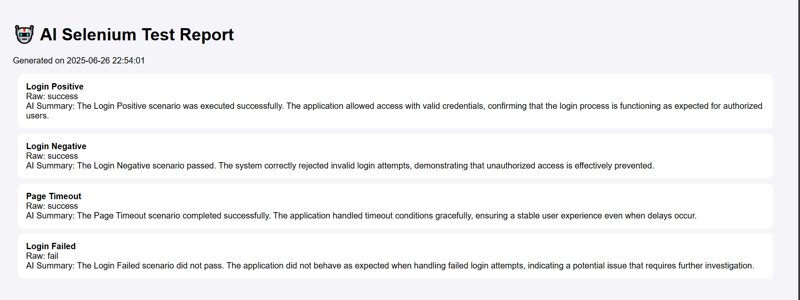
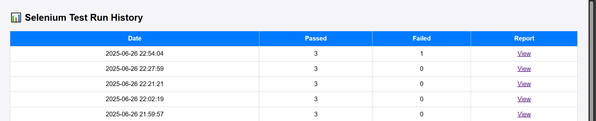
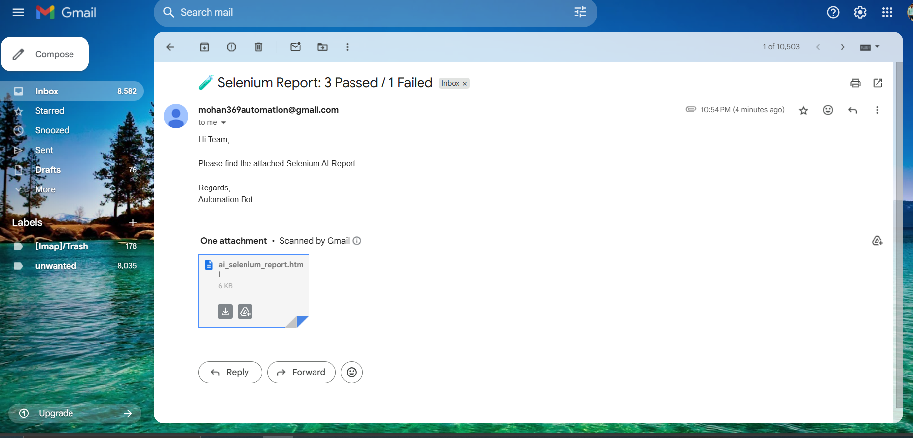

# 🤖 AI-Enhanced Hybrid Selenium Framework

Test smarter. Report better. Automate faster.


## ✨ What This Is

A professional, modular, AI-powered Selenium framework that:
- Generates HTML reports
- Sends email summaries
- Tracks test history
- Captures logs and screenshots
- Summarizes results using Gemini AI

📊 [See the dashboard](reports/dashboard.html)

📬 [View the AI report](reports/ai_selenium_report.html)

---

# Hybrid Selenium AI Framework

## 🚀 Overview

A robust, data-driven, and keyword-based Selenium automation framework enhanced with AI-powered test result summaries (Gemini/OpenAI). Features include HTML reporting, historical dashboards, and automated email notifications.

---

## ✨ Features

- **Data-Driven & Keyword-Based Automation**  
  Easily add new test cases and keywords for scalable automation.

- **AI-Powered Test Summaries**  
  Uses Gemini (Google Generative AI) to generate professional summaries for each test result.



- **HTML Reporting & Dashboard**  
  Generates detailed HTML reports and a historical dashboard ([reports/dashboard.html](reports/dashboard.html)) for all test runs.



- **Automated Email Notifications**  
  Sends the latest report via email with pass/fail statistics.



- **Logging & Screenshots**  
  Logs all test activity and captures screenshots on failure.

---

## 📁 Project Structure

```
README.md
requirements.txt
run_all_tests.py
.idea/
config/
    settings.py
data/
    login_data.csv
framework/
    ai_report.py
    dashboard_generator.py
    email_sender.py
    history_tracker.py
    logger.py
    test_runner.py
keywords/
    login_keywords.py
reports/
    ai_selenium_report.html
    dashboard.html
selenium_ai_framework/
    logs/
    results/
    screenshots/
test_cases/
    test_login_positive.py
    test_login_negative.py
    test_timeout_page.py
    test_login_failed.py
    
```

---

## ⚙️ Setup

1. **Install Requirements**

   ```sh
   pip install selenium google-generativeai
   ```

2. **Configure Settings**

   Edit `config/settings.py` with your email and Gemini API credentials.

3. **Run All Tests**

   ```sh
   python run_all_tests.py
   ```

---

## 📊 Output

- **Test Report:** [reports/ai_selenium_report.html](reports/ai_selenium_report.html)
- **Dashboard:** [reports/dashboard.html](reports/dashboard.html)
- **Logs:** [selenium_ai_framework/logs/](selenium_ai_framework/logs/)
- **Screenshots:** [selenium_ai_framework/screenshots/](selenium_ai_framework/screenshots/)

---

## 🧩 Adding New Test Cases

1. Create a new file in [test_cases/](test_cases/) (e.g., `test_new_feature.py`).
2. Define a function that accepts a Selenium `driver` and returns `"success"` or `"fail"`.
3. Import and call your test in `framework/test_runner.py`.

---

## 📬 Email Notifications

- The framework sends the latest HTML report to the configured recipient after each run.
- Configure sender/receiver and SMTP details in `config/settings.py`.

---

## 🤖 AI Summaries

- Summaries are generated using Gemini (Google Generative AI) for each test result.
- API key is set in `config/settings.py`.

---

## 📝 Data-Driven Example

See `data/login_data.csv` for sample login test data.

---

## 🛠️ Requirements

- Python 3.8+
- Chrome browser (for Selenium WebDriver)
- [selenium](https://pypi.org/project/selenium/)
- [google-generativeai](https://pypi.org/project/google-generativeai/)

---

## 📢 Share & Contribute

Feel free to fork, star, and share your feedback or improvements!  
Share your project on LinkedIn or GitHub to showcase your automation and AI skills.

---

## 📄 License

[MIT LICENSE](LICENSE)

